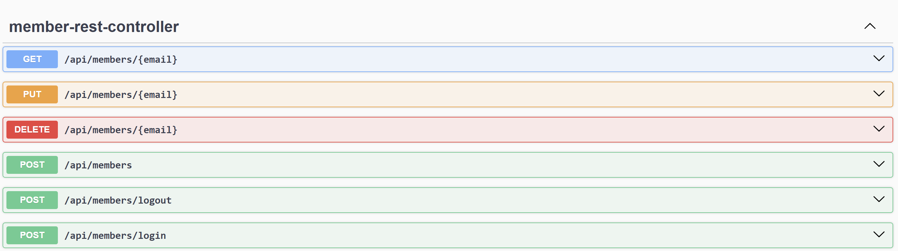

# 두번째 관통 프로젝트: 화면 설계

[](https://skillicons.dev)


# 0. 팀원 소개

| 팀원   |
| ------ |
| 김재윤 |
| 고세규 |

# 1. 기능 구현 목록
## 1.1. 구현 목록
| 난이도 | 구현 기능                           | 완성 여부 |
| :----: | :---------------------------------- | :-------: |
|  기본  | [지역별 관광지 정보 수집](#221-지역별-관광지-정보-수집)             |    ⭕     |
|  기본  | [관광지, 숙박, 음식점 조회](#222-관광지-숙박-음식점-조회)                     |    ⭕     |
|  기본  | [문화시설, 공연, 여행코스, 쇼핑 조회](#223-문화시설-공연-여행코스-쇼핑-조회)              |    ⭕     |
|  기본  | [회원 관리](#224-회원-관리)     |    ⭕     |
|  기본  | [로그인 관리](#225-로그인-관리)     |    ⭕     |
|  추가  | [여행 계획 경로 설정](#252-아파트별-조회) |    x     |
|  추가  | [회원 주도의 hotplace 등록](#31-비밀번호-찾기)                       |    x     |
|  심화  | [관광지 관련 뉴스 정보 크롤링](#42-공지사항-관리)                  |    x     |
|  심화  | [공지사항](#42-공지사항-관리)                  |    x     |
|  심화  | [공유게시판](#42-공지사항-관리)                  |    x     |


# 2. 기본 기능

## 2.1. 메인 페이지 및 메뉴 구성


## 2.2. 구현 기능

### 2.2.0. REST API & Swagger 구축
```java

    @PostMapping("/login")
    public ResponseEntity<?> login(@RequestParam String email,
                                   @RequestParam String password,
                                   HttpSession session) throws Exception {
        MemberDto member = memberService.login(email, password);
        if (member != null) {
            session.setAttribute("loginMember", member);
            return ResponseEntity.ok(member);
        } else {
            return ResponseEntity.status(401).body("아이디 또는 비밀번호가 일치하지 않습니다.");
        }
    }

    @PostMapping("/logout")
    public ResponseEntity<?> logout(HttpSession session) {
        session.invalidate();
        return ResponseEntity.ok("로그아웃 되었습니다.");
    }

    @GetMapping("/{email}")
    public ResponseEntity<MemberDto> getMemberDetail(@PathVariable String email) throws Exception {
        MemberDto member = memberService.findByEmail(email);
        if (member != null) return ResponseEntity.ok(member);
        throw new NoSuchElementException("해당 이메일의 사용자가 없습니다.");
    }

    @PostMapping
    public ResponseEntity<?> register(@RequestBody MemberDto user) throws Exception {
        memberService.addMember(user);
        return ResponseEntity.ok("회원가입이 완료되었습니다.");
    }

    @PutMapping("/{email}")
    public ResponseEntity<?> modifyUser(@PathVariable String email,
                                        @RequestBody MemberDto user,
                                        HttpSession session) throws Exception {
        user.setEmail(email);  // URL 경로의 이메일을 사용
        memberService.updateMember(user);
        session.setAttribute("loginMember", user);
        return ResponseEntity.ok("회원정보가 수정되었습니다.");
    }

    @DeleteMapping("/{email}")
    public ResponseEntity<?> deleteUser(@PathVariable String email, HttpSession session) throws Exception {
        memberService.deleteMemberByEmail(email);
        session.invalidate();
        return ResponseEntity.ok("회원탈퇴 완료");
    }
```

### 2.2.1. 지역별 관광지 정보 수집

### 2.2.2. 관광지, 숙박, 음식점 조회

### 2.2.3. 문화시설, 공연, 여행코스, 쇼핑 조회

### 2.2.4. 회원 관리


회원가입, 수정, 조회, 탈퇴 구현
### 2.2.5. 로그인 관리

로그인, 로그아웃 구현현
# 3. 추가 기능


# 4. 심화 기능
